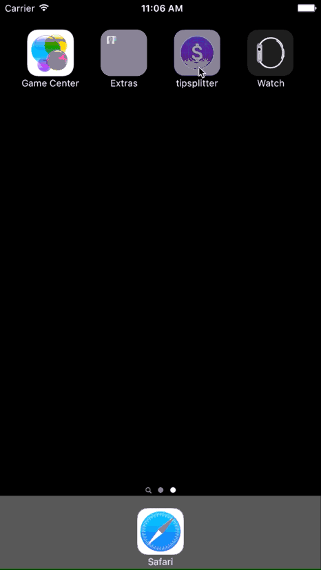

# CodePath iOS for Designers Prework
## Tip Calculator

This is Swift tip calculator application that is a requirement for the [CodePath iOS Bootcamp](https://codepath.com/iosbootcamp) appliation.

Time spent: ~ 6 hours

Completed user stories:

* [x] Required: Create a tip calculator in Swift
* [x] Optional: Change the colors and fonts of the views
* [x] Optional: Add a custom font
* [x] Optional: Add an app icon and launch image
* [x] Optional: Add image assets
* [ ] Optional: Add ability to split bill and view contribution per person (roughed in, need to finish)
* [x] Optional: Hide split bill feature in a hidden subview and show after clicking button to split
* [ ] Issue: Keep dollar sign visible after inputting bill amount
* [ ] Issue: If user clicks outside of input field and no amount is entered, show dollar sign
* [ ] Issue: Fix bug where submitting bill value > deleting bill value > clicking outside of bill field > clicking back on bill field > entering new value > results in no calculation

Check it out:

GIF created with [LiceCap](http://www.cockos.com/licecap/).

## License

    Copyright [2015] [© plainspace]

    Licensed under the Apache License, Version 2.0 (the "License");
    you may not use this file except in compliance with the License.
    You may obtain a copy of the License at

        http://www.apache.org/licenses/LICENSE-2.0

    Unless required by applicable law or agreed to in writing, software
    distributed under the License is distributed on an "AS IS" BASIS,
    WITHOUT WARRANTIES OR CONDITIONS OF ANY KIND, either express or implied.
    See the License for the specific language governing permissions and
    limitations under the License.
